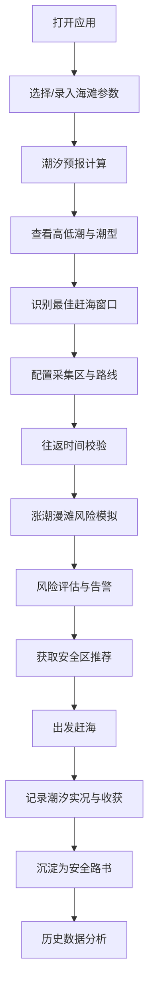

## 1. 产品概述

潮汐赶海安全规划系统是一款面向赶海拾贝爱好者的生产力工具，通过调和分潮模型精准预报潮位，规划最佳赶海窗口与安全撤离路线，防范涨潮围困风险。

- 核心目标：解决赶海爱好者对潮汐时间判断不准、退路规划不足、涨潮围困风险认知缺失等痛点
- 目标用户：沿海地区赶海拾贝爱好者、海钓爱好者、滩涂摄影爱好者
- 市场价值：填补专业赶海安全规划工具空白，提升户外活动安全性与效率

## 2. 核心功能

### 2.1 用户角色

| 角色 | 注册方式 | 核心权限 |
|------|---------|----------|
| 赶海爱好者 | 本地存储，无需注册 | 使用全部功能，记录个人赶海日志，生成专属路书 |

### 2.2 功能模块

1. **潮汐预报页**：调和分潮模型推算、高低潮时刻与潮高、大潮小潮标识、天文大潮预警
2. **窗口规划页**：最佳赶海窗口识别、滩涂可达面积估算、采集区往返时间计算
3. **安全退路页**：涨潮速度模拟、围困风险评估、实时安全区推荐、危险告警
4. **赶海日志页**：潮汐实况记录、收获统计、经验沉淀、历史数据回看
5. **路书页**：安全路线沉淀、撤离时点标记、海滩参数存档、分享导出

### 2.3 页面详情

| 页面名称 | 模块名称 | 功能描述 |
|---------|---------|----------|
| 潮汐预报页 | 海滩参数配置 | 录入潮汐表基准站、调和分潮参数、地形坡度数据 |
| 潮汐预报页 | 每日潮位曲线 | 24小时潮位曲线图，标注高低潮时刻与潮高 |
| 潮汐预报页 | 潮型标识 | 识别大潮、小潮、天文大潮，标注对滩涂面积影响 |
| 窗口规划页 | 赶海窗口计算 | 识别落潮到最低位的最佳时长窗口，显示可采集时间 |
| 窗口规划页 | 采集区管理 | 配置各采集区位置、距离、步行速度、目标潮高 |
| 窗口规划页 | 往返时间校验 | 计算下海点到各采集区往返时间，确保涨潮前撤离 |
| 安全退路页 | 涨潮漫滩模拟 | 模拟涨潮速度在平缓滩涂的漫滩过程，对比步行速度 |
| 安全退路页 | 围困风险评估 | 计算漫滩超过步行速度的风险等级，实时告警 |
| 安全退路页 | 危险告警面板 | 回头潮告警、堤坝缺口积水告警、退路阻断告警 |
| 安全退路页 | 实时安全推荐 | 按当前潮位推荐可安全前往的滩涂分区 |
| 赶海日志页 | 实况记录 | 记录每次赶海的实际潮汐、天气、收获重量与种类 |
| 赶海日志页 | 历史回看 | 按日期、海滩、收获量筛选历史记录 |
| 赶海日志页 | 统计分析 | 月度/季度赶海次数、总收获量、最佳海滩排名 |
| 路书页 | 安全路线管理 | 保存下海点、途经点、采集区、撤退路线 |
| 路书页 | 撤离时点沉淀 | 记录各点位必须撤离的临界潮高与时间 |
| 路书页 | 海滩档案 | 存储各海滩的地形参数、潮汐基准、危险区域 |

## 3. 核心流程

用户打开应用 → 选择或录入海滩参数 → 查看潮汐预报 → 规划赶海窗口与采集区 → 模拟涨潮风险 → 获取安全推荐 → 出发赶海 → 记录实况日志 → 沉淀安全路书

## 4. 用户界面设计

### 4.1 设计风格
- **主色调**：深海蓝 `#0A2463` 作为主色，水青绿 `#3E92CC` 作为辅助色，警示橙 `#F46036` 用于风险告警
- **按钮风格**：圆角 12px，带微妙阴影，点击反馈清晰
- **字体**：标题使用 `Noto Sans SC Bold`，正文使用 `Noto Sans SC Regular`，数字使用等宽字体增强可读性
- **布局风格**：卡片式布局，信息层级分明，关键数据突出显示
- **图标风格**：使用海洋主题图标，🌊 潮汐、🐚 贝壳、⏰ 时间、⚠️ 告警、📝 日志、🗺️ 路书

### 4.2 页面设计概述

| 页面名称 | 模块名称 | UI 元素 |
|---------|---------|----------|
| 潮汐预报页 | 潮位曲线 | 渐变填充曲线图，高低潮用圆点标注，今日区域高亮 |
| 潮汐预报页 | 潮型卡片 | 大潮/小潮/天文大潮用不同颜色标识，附滩涂面积影响百分比 |
| 窗口规划页 | 时间轴 | 横向滑动时间轴，赶海窗口区域高亮，标注下海/回撤时点 |
| 窗口规划页 | 采集区列表 | 卡片式展示各采集区，显示距离、往返时间、安全余量 |
| 安全退路页 | 风险仪表盘 | 环形进度条显示围困风险等级，绿黄橙红四色分级 |
| 安全退路页 | 告警列表 | 逐项列出危险项，可展开查看详情与应对措施 |
| 安全退路页 | 安全区地图 | 简化示意图，用颜色标注当前可安全前往的区域 |
| 赶海日志页 | 日志卡片 | 展示日期、海滩、天气、潮汐实况、收获照片与重量 |
| 赶海日志页 | 统计图表 | 柱状图展示月度赶海次数，饼图展示收获种类占比 |
| 路书页 | 路线卡片 | 展示路线名称、关键点位、撤离时点、最后更新时间 |
| 路书页 | 海滩档案 | 展示海滩参数、地形坡度、危险区域备注 |

### 4.3 响应式
- **移动优先**：以 375px 宽度为基准设计，所有交互适配触屏操作
- **自适应**：使用 Tailwind 响应式断点，在 768px、1024px 以上优化布局
- **触摸优化**：按钮最小高度 44px，滑动操作流畅，避免误触

### 4.4 离线能力
- 数据全部存储在 LocalStorage，无网络时可正常使用
- 潮汐计算完全在本地完成，无需依赖服务器
- PWA 支持，可添加到主屏幕离线启动
