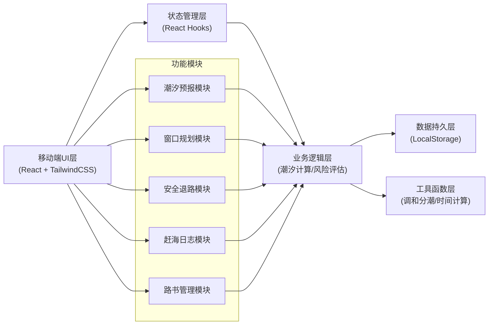
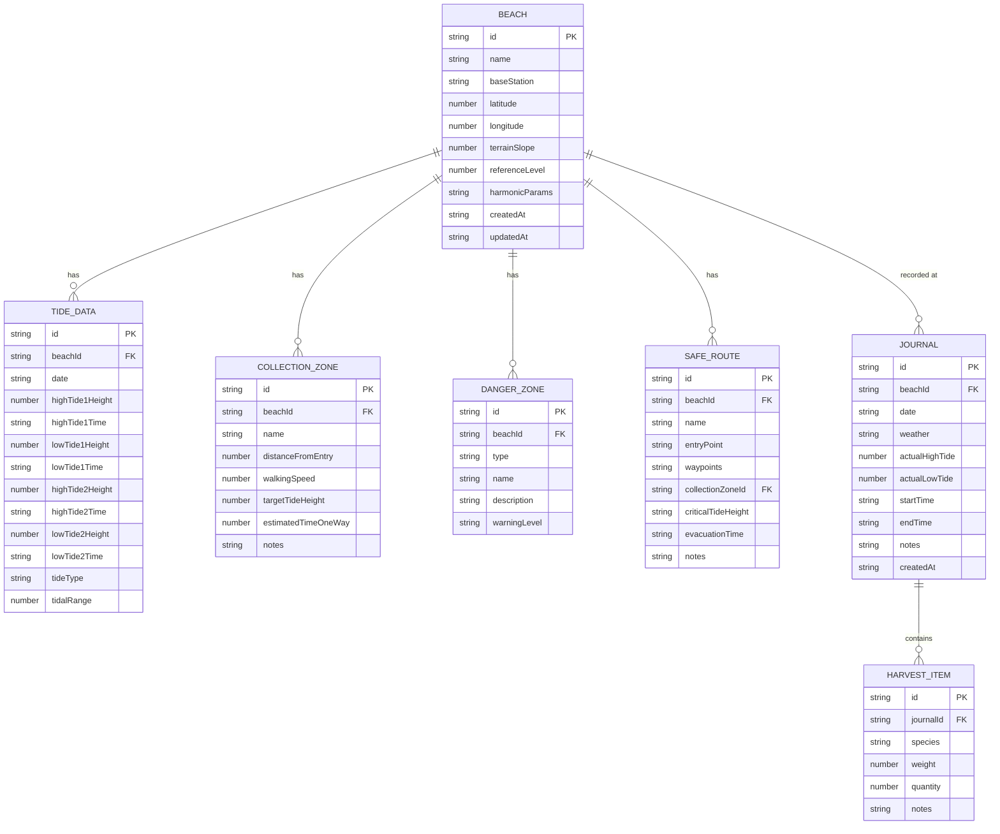

## 1. 架构设计



## 2. 技术描述

- **前端**：React@18 + TypeScript + TailwindCSS@3 + Vite@5
- **初始化工具**：npm create vite@latest
- **后端**：无后端，纯前端应用，本地计算
- **数据库**：LocalStorage 本地存储
- **图表**：recharts@2 用于潮位曲线、统计图表
- **路由**：react-router-dom@6 单页应用路由
- **图标**：lucide-react@0.344 统一图标库
- **日期处理**：dayjs@1 处理潮汐时间计算
- **PWA**：vite-plugin-pwa@0.19 实现离线可用

## 3. 路由定义

| 路由 | 页面 | 功能 |
|------|------|------|
| /tide | 潮汐预报页 | 潮位曲线、高低潮时刻、潮型标识 |
| /window | 窗口规划页 | 赶海窗口识别、采集区配置、往返时间校验 |
| /safety | 安全退路页 | 涨潮模拟、风险评估、危险告警、安全推荐 |
| /journal | 赶海日志页 | 实况记录、历史回看、统计分析 |
| /guide | 路书页 | 路线管理、撤离时点、海滩档案 |
| / | 重定向到 /tide | - |

## 4. 数据模型

### 4.1 数据模型定义



### 4.2 核心计算模型

#### 调和分潮模型
```typescript
interface HarmonicConstituent {
  name: string;      // 分潮名称 M2, S2, K1, O1 等
  amplitude: number; // 振幅 (cm)
  phase: number;     // 相位 (度)
  speed: number;     // 角速度 (度/小时)
}

// 潮位计算公式
function calculateTideLevel(
  constituents: HarmonicConstituent[],
  date: Date,
  referenceLevel: number
): number {
  let level = referenceLevel;
  const t = hoursSinceDate(date);
  for (const c of constituents) {
    level += c.amplitude * Math.cos((c.speed * t - c.phase) * Math.PI / 180);
  }
  return level;
}
```

#### 涨潮漫滩风险模型
```typescript
interface InundationRisk {
  riskLevel: 'low' | 'medium' | 'high' | 'extreme';
  inundationSpeed: number;      // 漫滩速度 (m/min)
  walkingSpeed: number;         // 步行速度 (m/min)
  safeReturnTime: number;       // 安全返回时间 (min)
  criticalWarning: string[];
}

function calculateInundationRisk(
  tideRiseRate: number,         // 涨潮速率 (cm/min)
  terrainSlope: number,         // 地形坡度 (m/km)
  distance: number,             // 距离 (m)
  walkingSpeed: number          // 步行速度 (m/min)
): InundationRisk {
  const inundationSpeed = tideRiseRate * 100 / terrainSlope;
  const ratio = inundationSpeed / walkingSpeed;
  // ... 风险等级判断逻辑
}
```

## 5. 模块结构

```
src/
├── components/          # 通用组件
│   ├── Layout/          # 布局组件（底部导航、顶部栏）
│   ├── TideChart/       # 潮位曲线图组件
│   ├── RiskGauge/       # 风险仪表盘组件
│   ├── Card/            # 卡片组件
│   └── Alert/           # 告警组件
├── pages/               # 页面组件
│   ├── TidePage/        # 潮汐预报页
│   ├── WindowPage/      # 窗口规划页
│   ├── SafetyPage/      # 安全退路页
│   ├── JournalPage/     # 赶海日志页
│   └── GuidePage/       # 路书页
├── hooks/               # 自定义 Hooks
│   ├── useTideCalc.ts   # 潮汐计算 Hook
│   ├── useLocalStorage.ts
│   └── useBeachData.ts
├── utils/               # 工具函数
│   ├── tideHarmonics.ts # 调和分潮计算
│   ├── timeUtils.ts     # 时间计算工具
│   ├── riskAssessment.ts # 风险评估
│   └── constants.ts     # 常量定义
├── types/               # TypeScript 类型定义
│   ├── beach.ts
│   ├── tide.ts
│   ├── journal.ts
│   └── safety.ts
├── data/                # Mock 数据与默认配置
│   ├── defaultBeaches.ts
│   └── harmonicConstituents.ts
├── App.tsx
├── main.tsx
└── index.css
```

## 6. 关键技术决策

1. **纯前端架构**：所有计算在本地完成，确保离线可用，保护用户隐私
2. **LocalStorage 持久化**：数据存储在浏览器本地，无需后端服务
3. **PWA 支持**：使用 vite-plugin-pwa 实现离线缓存和添加到主屏幕
4. **调和分潮模型**：实现简化的 4 分潮（M2, S2, K1, O1）预报模型，兼顾精度与性能
5. **响应式设计**：TailwindCSS 实现移动优先的响应式布局
6. **图表库选型**：recharts 轻量级图表库，支持 SVG 渲染，适合移动端
7. **状态管理**：使用 React Context + useReducer 管理全局海滩参数状态，避免过度设计
